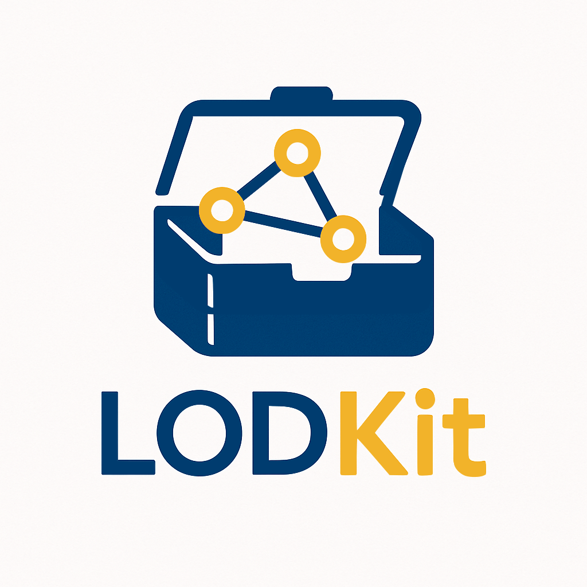

# LODKit

[](https://coveralls.io/github/lu-pl/lodkit?branch=main&kill_cache=1)
[](https://www.gnu.org/licenses/gpl-3.0)
[](https://badge.fury.io/py/lodkit)
[](https://github.com/astral-sh/ruff)
[](https://github.com/astral-sh/uv)

<!-- <a href="https://github.com/psf/black"></a> -->

LODKit is a collection of Linked Open Data related Python functionalities.


# Installation

LODKit is available on PyPI:

```shell
pip install lodkit
```

# Usage

## Triple Constructor

The `lodkit.ttl` triple constructor implements a Turtle-inspired functional DSL for RDF Graph generation.

`lodkit.ttl` aims to emulate RDF Turtle syntax by featuring Python equivalents for

- [Predicate List notation](https://www.w3.org/TR/turtle/#predicate-lists)
- [Object List notation](https://www.w3.org/TR/turtle/#object-lists)
- [Blank Node notation](https://www.w3.org/TR/turtle/#BNodes)
- [RDF Collections](https://www.w3.org/TR/turtle/#collections)

and is recursive/composable on all code paths.

`lodkit.ttl` implements the `Iterable[lodkit.types.Triple]` protocol and exposes a `to_graph` method for convenient construction of an `rdflib.Graph` instance.

### Examples

The following examples show features of the `lodkit.ttl` triple constructor and display the equivalent RDF graph for comparison.

#### Predicate List notation

The `lodkit.ttl` constructor takes a triple subject and an arbitrary number of triple predicate-object constellations as input; this aims to emulate Turtle Predicate List notation.

The constructor accepts any RDFLib-compliant triple object in the object position, plain strings are interpreted as `rdflib.Literal`.

```python
from lodkit import ttl
from rdflib import Namespace

ex = Namespace("https://example.com/")

triples = ttl(
    ex.s,
    (ex.p, ex.o),
    (ex.p2, "literal")
)
```

```ttl
@prefix ex: <https://example.com/> .

ex:s ex:p ex:o ;
    ex:p2 "literal" .
```

#### Object List notation

Predicate-object constellation arguments in `lodkit.ttl` can be of arbitrary length; the first element is interpreted as triple predicate, all succeeding elements are interpreted as Turtle Object List.

```python
triples = ttl(
    ex.s,
    (ex.p, ex.o1, ex.o2, "literal")
)
```

```ttl
@prefix ex: <https://example.com/> .

ex:s ex:p ex:o1, ex:o2, "literal" .
```

#### Blank Node notation

Python lists (of predicate-object constellations) in the object position of predicate-object constellations are interpreted as Turtle Blank Nodes.

```python
triples = ttl(
    ex.s,
    (
        ex.p, [
            (ex.p2, ex.o),
            (ex.p3, "1", "2")
        ]
    )
)
```

```ttl
@prefix ex: <https://example.com/> .

ex:s ex:p [ 
	ex:p2 ex:o ;
	ex:p3 "1", "2" 
] .
```

#### RDF Collections
Python tuples in the object position of predicate-object constellations are interpreted as Turtle Collection:

```python
triples = ttl(
    ex.s,
    (ex.p, (ex.o, "1", "2", "3"))
)
```

```ttl
@prefix ex: <https://example.com/> .

ex:s ex:p ( ex:o "1" "2" "3" ) .
```

#### Recursion on all paths

One of the strengths of `lodkit.ttl` is that it is recursive on all code paths.

To demonstrate the composability of the `lodkit.ttl` constructor, one could e.g. define a `lodkit.ttl` object that has another `lodkit.ttl` object and a blank node with an object list and yet another `lodkit.ttl` object (in a single element RDF Collection) defined within an RDF Collection:


```python
triples = ttl(
    ex.s,
    (
        ex.p,
        (
            ttl(ex.s2, (ex.p2, "1")),
            [
                (ex.p3, "2", "3"),
                (ex.p4, (ttl(ex.s3, (ex.p5, "4")),))
            ],
        ),
    ),
)
```

```ttl
@prefix ex: <https://example.com/> .

ex:s ex:p ( 
	ex:s2 
	[ 
		ex:p3 "2", "3" ;
        ex:p4 ( ex:s3 ) 
	] 
) .

ex:s2 ex:p2 "1" .

ex:s3 ex:p5 "4" .
```

This is actually a relatively simple example. Triple objects in the `lodkit.ttl` constructor can be *arbitrarily* nested. 

`lodkit.ttl` is pretty recursive! :)


### Building Triple Chains

As mentioned, `lodkit.ttl` implements the `Iterable[lodkit.types.Triple]` protocol; arbitrary `lodkit.ttl` instances can therefore be chained to create highly modular and scalable triple generation pipelines.

A minimal example of such a (layered) triple pipeline could look like this:

```python
class TripleGenerator:

    def triple_generator_1(self) -> Iterator[Triple]:
        if conditional:
            yield (s, p, o)
        yield from ttl(s, ...)

    # more triple generator method definitions
    ...

    def __iter__(self) -> Iterator[Triple]:
        return itertools.chain(
            self.triple_generator_1(),
            self.triple_generator_2(),
            self.triple_generator_3(),
            ...
        )

triples: Iterator[Triple] = itertools.chain(TripleGenerator(), ...)
```

## TripleChain

LODKit provides a `TripleChain` class for convenient triple chain construction. Also see [Building Triple Chains](#building-triple-chains).

`lodkit.TripeChain` is a simple `itertools.chain` subclass that implements a fluid chain interface for arbitrary successive chaining and a `to_graph` method for deriving an `rdflib.Graph` from a given chain.

> Note that, unlike `lodkit.ttl`, `TripleChain` is an `Iterator` and can be exhausted, e.g. by calling `TripleChain.to_graph`.

```python
from collections.abc import Iterator

from lodkit import TripleChain, ttl
from lodkit.types import Triple
from rdflib import Graph, Namespace

ex = Namespace("https://example.com/")


triples = ttl(ex.s, (ex.p, "1", "2", "3"))
more_triples = ttl(ex.s, (ex.p2, [(ex.p3, ex.o)]))
yet_more_triples = ttl(ex.s, (ex.p3, ex.o))


def any_iterable_of_triples() -> Iterator[Triple]:
    yield (ex.s, ex.p, ex.o)


triple_chain = (
    TripleChain(triples, more_triples)
    .chain(yet_more_triples)
    .chain(any_iterable_of_triples())
)

ex_graph = Graph()
ex_graph.bind("ex", ex)

graph: Graph = triple_chain.to_graph(graph=ex_graph)
print(graph.serialize())
```

```ttl
@prefix ex: <https://example.com/> .

ex:s ex:p ex:o,
        "1",
        "2",
        "3" ;
    ex:p2 [ ex:p3 ex:o ] ;
    ex:p3 ex:o .
```


## RDF Importer

`lodkit.RDFImporter` is a custom importer for parsing RDF files into `rdflib.Graph` objects.

Assuming `graphs/some_graph.ttl` exists in the import path, `lodkit.RDFImporter` makes it possible to import the RDF file like a module:

```python
from graphs import some_graph

type(some_graph)  # <class 'rdflib.graph.Graph'>
```

RDF import functionality is available after registering `lodkit.RDFImporter` with the import maschinery e.g by calling `lodkit.enable_rdf_import`.

## Types

`lodkit.types` defines several useful types for working with RDFLib-based Python code.

## URI Tools

### uriclass, make_uriclass

`uriclass` and `make_uriclass` provide dataclass-inspired URI constructor functionality.

With `uriclass`, class-level attributes are converted to URIs according to uri_constructor.
For class attributes with just type information, URIs are constructed using UUIDs,
for class attributes with string values, URIs are constructed using hashing based on that string.

```python
from lodkit import uriclass

@uriclass(Namespace("https://test.org/test/"))
class uris:
    x1: str

    y1 = "hash value 1"
    y2 = "hash value 1"

    print(uris.x1)             # Namespace("https://test.org/test/<UUID>")
    print(uris.y1 == uris.y2)  # True
```

`make_uriclass` provides equalent functionality but is more apt for dynamic use.

```python
from lodkit import make_uriclass

uris = make_uriclass(
    cls_name="TestURIFun",
	    namespace="https://test.org/test/",
        fields=("x", ("y1", "hash value 1"), ("y2", "hash value 1")),
    )

    print(uris.x1)             # Namespace("https://test.org/test/<UUID>")
    print(uris.y1 == uris.y2)  # True
```
	
### uritools.utils
`uritools.utils` defines base functionality for generating UUID-based and hashed URIs.

`URIConstructorFactory` (alias of `mkuri_factory`) constructs a callable for generating URIs.
The returned callable takes an optional str argument 'hash_value'; 
If a hash value is given, the segment is generated using a hash function, else the path is generated using a uuid.

```python
from lodkit import URIConstructorFactory

mkuri = URIConstructorFactory("https://test.namespace/")
print(mkuri())                         # URIRef("https://test.namespace/<UUID>")
print(mkuri("test") == mkuri("test"))  # True
```

## Namespace Tools

### NamespaceGraph
`lodkit.NamespaceGraph` is a simple rdflib.Graph subclass for easy and convenient namespace binding.

```python
from lodkit import NamespaceGraph
from rdflib import Namespace

class CLSGraph(NamespaceGraph):
	crm = Namespace("http://www.cidoc-crm.org/cidoc-crm/")
	crmcls = Namespace("https://clscor.io/ontologies/CRMcls/")
	clscore = Namespace("https://clscor.io/entity/")

graph = CLSGraph()

ns_check: bool = all(
	ns in map(lambda x: x[0], graph.namespaces())
	for ns in ("crm", "crmcls", "clscore")
)

print(ns_check)  # True
```

## ClosedOntologyNamespace, DefinedOntologyNamespace
`lodkit.ClosedOntologyNamespace` and `lodkit.DefinedOntologyNamespace` are `rdflib.ClosedNamespace` and `rdflib.DefinedNameSpace` subclasses 
that are able to load namespace members based on an ontology.

```python
crm = ClosedOntologyNamespace(ontology="./CIDOC_CRM_v7.1.3.ttl")

crm.E39_Actor   # URIRef('http://www.cidoc-crm.org/cidoc-crm/E39_Actor')
crm.E39_Author  # AttributeError
```

```python
class crm(DefinedOntologyNamespace):
	ontology = "./CIDOC_CRM_v7.1.3.ttl"

crm.E39_Actor   # URIRef('http://www.cidoc-crm.org/cidoc-crm/E39_Actor')
crm.E39_Author  # URIRef('http://www.cidoc-crm.org/cidoc-crm/E39_Author') + UserWarning
```


Note that `rdflib.ClosedNamespaces` are meant to be instantiated and `rdflib.DefinedNameSpaces` are meant to be extended,
which is reflected in `lodkit.ClosedOntologyNamespace` and `lodkit.DefinedOntologyNamespace`.


## Testing Tools
`lodkit.testing_tools` aims to provide general definitions (e.g Graph format options) and [Hypothesis](https://hypothesis.readthedocs.io/en/latest/) strategies useful for testing RDFLib-based Python and code.

E.g. the `TripleStrategies.triples` strategy generates random triples utilizing all permissible subject, predicate and object types including lang-tagged and xsd-typed literals.
The following uses the triples strategies together with a Hypothesis strategy to create random graphs:

```python
from hypothesis import given, strategies as st
from lodkit import tst
from rdflib import Graph


@given(triples=st.lists(tst.triples, min_size=1, max_size=10))
def test_some_function(triples):
    graph = Graph()
    for triple in triples:
        graph.add(triple)

    assert len(graph) == len(triples)
```

The strategy generates up to 100 (by default, see [settings](https://hypothesis.readthedocs.io/en/latest/settings.html)) lists of 1-10 `tuple[lodkit.types.TripleSubject, URIRef, lodkit.types.TripleObject]` and passes them to the test function.

> Warning: The API of lodkit.tesing_tools is very likely to change soon! Strategies should be module-level callables and not properties of a Singleton.
